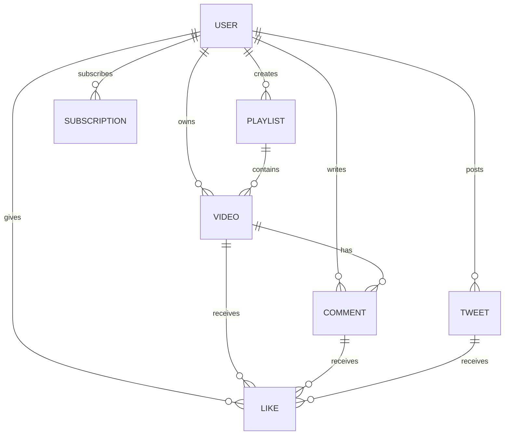

# 🎬 VideoTube — Backend API

A production-grade RESTful backend for a **YouTube-like video-sharing platform**, built with **Express 5** and **MongoDB**. It powers user authentication (JWT + refresh tokens), media uploads via **Cloudinary**, channel subscriptions, video management, playlists, comments, likes, tweets, and watch-history tracking — all through a clean, versioned API.

---

## ✨ Features

- **User Authentication & Authorization**
  - Register / Login / Logout with secure, HTTP-only cookie-based sessions
  - Dual-token strategy — short-lived **Access Tokens** and long-lived **Refresh Tokens** (JWT)
  - Password hashing with **bcrypt** (salt rounds: 10)
  - Protected routes via a reusable JWT verification middleware

- **Media & File Uploads**
  - Avatar and cover-image uploads through **Multer** (disk storage → `public/temp/`)
  - Automatic upload to **Cloudinary** with local-file cleanup on success or failure
  - Supports any resource type (`auto` detection — images, video, etc.)

- **User Profile & Channel System**
  - Update account details, avatar, and cover image independently
  - Channel profile pages with **subscriber / subscribed-to counts** computed via MongoDB aggregation pipelines
  - "Is Subscribed" flag resolved in real time for the requesting user

- **Video Platform Core**
  - Video model with file URL, thumbnail, description, duration, view count, and publish status
  - Aggregate-based **paginated queries** (`mongoose-aggregate-paginate-v2`)
  - Full **watch history** with nested lookups resolving video owners

- **Social Features**
  - **Subscriptions** — subscribe / unsubscribe to channels
  - **Likes** — polymorphic likes on videos, comments, and tweets
  - **Comments** — threaded comments on videos (paginated)
  - **Playlists** — named collections of videos per user
  - **Tweets** — short-form text posts by users

- **Developer-Friendly Utilities**
  - `ApiError` class — structured error responses with status codes and stack traces
  - `ApiResponse` class — consistent success envelopes (`{ statusCode, data, message, success }`)
  - `asyncHandler` — promise-based wrapper eliminating repetitive try/catch in controllers

---

## 🛠 Tech Stack

| Layer | Technology |
|---|---|
| **Runtime** | Node.js (ES Modules) |
| **Framework** | Express 5 |
| **Database** | MongoDB + Mongoose 9 |
| **Authentication** | JSON Web Tokens (`jsonwebtoken`) + bcrypt |
| **File Uploads** | Multer 2 → Cloudinary v2 |
| **Dev Tooling** | Nodemon, dotenv |
| **Pagination** | mongoose-aggregate-paginate-v2 |
| **Cookie Handling** | cookie-parser |
| **CORS** | cors |

---

## 📁 Project Structure

```
BackendBase/
├── public/
│   └── temp/                   # Multer temp upload directory
├── src/
│   ├── controllers/
│   │   └── user.controller.js  # All user-related business logic
│   ├── db/
│   │   └── index.js            # MongoDB connection via Mongoose
│   ├── middleware/
│   │   ├── auth.middleware.js   # JWT verification guard
│   │   └── multer.middleware.js # Disk-storage file upload config
│   ├── models/
│   │   ├── user.model.js       # User schema + password hashing + token generation
│   │   ├── videos.model.js     # Video schema + aggregate pagination plugin
│   │   ├── comment.model.js    # Comment schema (paginated)
│   │   ├── like.model.js       # Polymorphic like schema
│   │   ├── playlist.model.js   # Playlist schema
│   │   ├── subscription.model.js # Subscriber ↔ Channel relationship
│   │   └── tweet.model.js      # Tweet / short-post schema
│   ├── routes/
│   │   └── user.routes.js      # RESTful route definitions
│   ├── utils/
│   │   ├── ApiError.js         # Custom error class
│   │   ├── ApiResponse.js      # Standardised response wrapper
│   │   ├── asyncHandler.js     # Async middleware error catcher
│   │   └── cloudinary.js       # Cloudinary upload helper
│   ├── app.js                  # Express app initialisation & middleware stack
│   ├── constants.js            # Shared constants (DB_NAME)
│   └── index.js                # Server entry point
├── .env.sample                 # Environment variable template
├── .gitignore
├── package.json
└── package-lock.json
```

---

## 🔌 API Reference

All routes are prefixed with **`/api/v1/users`**.

### Public Routes

| Method | Endpoint | Description |
|---|---|---|
| `POST` | `/register` | Register a new user (multipart: `avatar`, `coverImage`) |
| `POST` | `/login` | Login with username/email + password |
| `POST` | `/refresh-token` | Refresh an expired access token |
| `GET` | `/c/:username` | Get a channel's public profile |

### Protected Routes (require JWT)

| Method | Endpoint | Description |
|---|---|---|
| `POST` | `/logout` | Logout and clear tokens |
| `POST` | `/change-password` | Change the current user's password |
| `GET` | `/current-user` | Get the authenticated user's profile |
| `PATCH` | `/useraccount` | Update full name and email |
| `PATCH` | `/avatar` | Upload a new avatar image |
| `PATCH` | `/cover-image` | Upload a new cover image |
| `GET` | `/history` | Get the user's watch history |

---

## 📋 Prerequisites

| Requirement | Version |
|---|---|
| **Node.js** | v18+ recommended |
| **npm** | v9+ |
| **MongoDB** | Running instance (local or Atlas) |
| **Cloudinary Account** | Free tier works — [sign up here](https://cloudinary.com/) |

---

## 🚀 Build & Installation

```bash
# 1. Clone the repository
git clone https://github.com/<your-username>/BackendBase.git
cd BackendBase

# 2. Install dependencies
npm install

# 3. Create your environment file from the template
cp .env.sample .env        # Linux/macOS
copy .env.sample .env      # Windows (CMD)

# 4. Fill in your .env values
#    PORT             → e.g. 8000
#    MONGODB_URI      → e.g. mongodb+srv://<user>:<pass>@cluster.mongodb.net
#    CORS_ORIGIN      → e.g. * or http://localhost:3000
#    ACCESS_TOKEN_SECRET   → any long random string
#    ACCESS_TOKEN_EXPIRY   → e.g. 1d
#    REFRESH_TOKEN_SECRET  → any long random string
#    REFRESH_TOKEN_EXPIRY  → e.g. 10d
#    CLOUDINARY_CLOUD_NAME → from your Cloudinary dashboard
#    CLOUDINARY_API_KEY    → from your Cloudinary dashboard
#    CLOUDINARY_API_SECRET → from your Cloudinary dashboard

# 5. Start the development server
npm run dev
```

The server will start on `http://localhost:<PORT>` (default `8000`).

---

## 🎯 Usage

Once the server is running, interact with the API using **Postman**, **cURL**, or any HTTP client.

### Register a new user

```bash
curl -X POST http://localhost:8000/api/v1/users/register \
  -F "fullName=Jay Patil" \
  -F "email=jay@example.com" \
  -F "username=jay" \
  -F "password=securepassword" \
  -F "avatar=@/path/to/avatar.png"
```

### Login

```bash
curl -X POST http://localhost:8000/api/v1/users/login \
  -H "Content-Type: application/json" \
  -d '{"username": "jay", "password": "securepassword"}'
```

The response sets `accessToken` and `refreshToken` as HTTP-only cookies. Include them in subsequent requests to access protected routes.

### Access a protected route

```bash
curl http://localhost:8000/api/v1/users/current-user \
  -H "Authorization: Bearer <accessToken>"
```

---

## 🗄 Data Models


